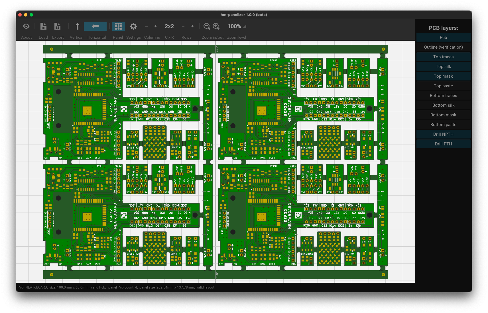

# halfmarble-panelizer

A GUI based PCB gerber file viewer and panelizer written in python

This tool would not have been possible without the following projects:

www.kicad.org

www.kivy.org

www.github.com/curtacircuitos/pcb-tools

www.github.com/opiopan/pcb-tools-extension

www.useiconic.com/open

We are releasing it under MIT license, Copyright 2021,2022 HalfMarble LLC (www.halfmarble.com)

## Screenshots:

Main view

Main view (outline verification)

Panel view

### WARNING !

We hope that you will find hm-panelizer useful, however, we offer no guarantee that it will work in your case - 
always verify with other tools, before you order your Pcb panels!

## Why did we create hm-panelizer?

There are a couple of open source tools out there that will help you panelize your Pcb, 
for example http://blog.thisisnotrocketscience.nl/projects/pcb-panelizer/ and www.github.com/yaqwsx/KiKit,
however, we wanted a GUI based app, which we could run on a macOS based machine. We could not find one,
so we decided to write one.

## Will hm-panelizer work with my Pcb?

It might. We personally use KiCad 6.x and we wanted to panelize our own Pcb (NEAToBOARD),
so that's what we mostly tested. We did try a few other Pcbs created with other software and we are eager to hear your
experience.

Please keep in mind, however, that hm-panelizer was just a side project for us. We are releasing it
as open source in hopes that the community will contribute to it.  If you find a bug and can fix it, then please help!

Having said that, here are requirements to create a Pcb that should make it suitable for hm-panelizer:

- use metric system (we haven't honestly even tried imperial)
- your pcb gerber files must use Altium/Protel filename extensions (see https://pcbprime.com/pcb-tips/accepted-file-formats/Gerber%20File%20Extension%20Comparison.pdf)
- the board outline gerber file (.gm1) must be present
- currently, our tool can only add mouse-bites to perfectly straight lines (see hm-panelizer's "Outline verification" feature)
- for optimal results use drill/place origin and grid origin at (0, 0)

Here are the KiCad settings we personally use to export our Pcbs:

KiCad plot settings

KiCad drill settings

## TODO

Here is a list of features we want to add:

- KiCad BOM conversion to popular PCB house (JLC, PCBWay, Oshpark, etc.) formats
- panelize parts placement

## Need help?

Visit our Discord channel https://discord.gg/7mf5qqBMEF

#### Please consider supporting us if you like hm-panelizer and you want to see more features!
