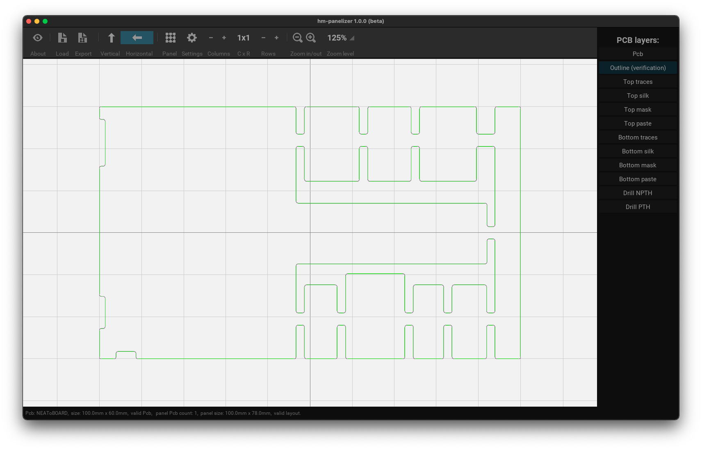
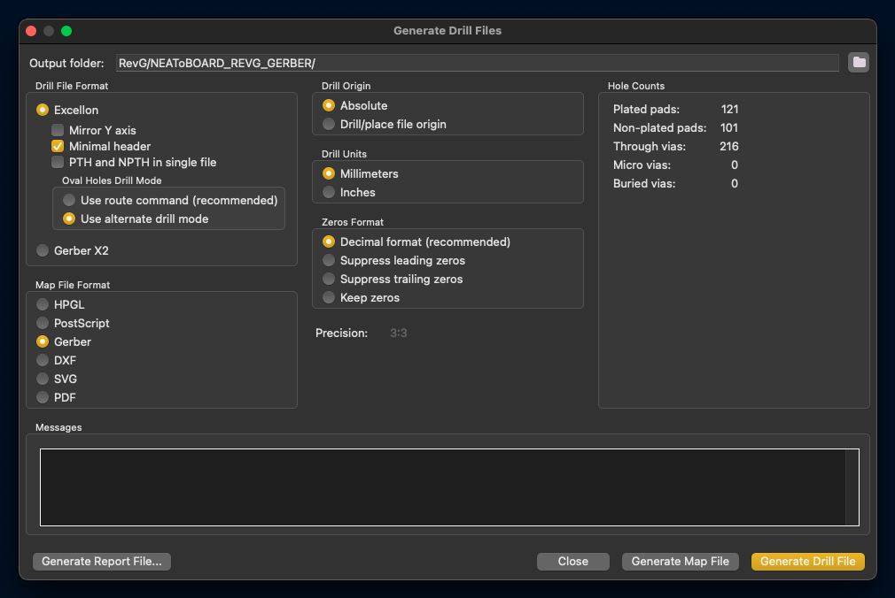

# We are not quite ready to announce our tool yet!
As the authors of this software, we kindly ask you not to announce our tool anywhere yet.

If you came here by a random chance or were asked to beta test it or pre-review it, then please feel free
to take the tool out for a spin, but kindly do not discuss it in public yet.

Thank you!

# hm-panelizer

A GUI based PCB gerber file viewer and panelizer written in python

This tool would not have been possible without the following projects:

www.kicad.org

www.kivy.org

www.github.com/curtacircuitos/pcb-tools

www.github.com/opiopan/pcb-tools-extension

www.useiconic.com/open

We are releasing it under MIT license, Copyright 2021,2022 HalfMarble LLC (www.halfmarble.com)

Please note that we forked **_pcb-tools_** and **_pcb-tools-extension_**, made significant modifications,
and included both of these projects as part of our tool. We tried at first to keep minimal changes
to those projects, so that we could contribute back, but we eventually ended up needing to make many changes,
some of them incompatible or unwanted (for example changing names of APIs to make it easier for us to follow the code) with those projects,
and contributing back would add significant amount of development time. We feel unhappy that
we were unable to find an easy way to contribute back to those projects, and hope that someone can
reconcile our contributions back to these projects one day.

## How to run

hm-panelizer is a **_python app_**, so you will need **_python_** version `3.6.x` or higher (we use `3.9.7`) Once you have it installed on your system,
you will need the following python packages (optional - use **_pip3_** to help you manage python packages):

- `kivy`
- `cairo` (comes with most python distributions?)

Once you have `python 3.6.x` and the required python packages installed, you can run hm-panelizer via command line
(i.e. terminal) by `cd`'ing into the hm-panelizer folder, then issuing `python3 main.py` command.

## Screenshots:

Main view

Main view (outline verification)

Panel view

## _! WARNING !_

_We hope that you will find hm-panelizer useful, however, we offer no guarantee that it will work in your case - 
always verify with other tools, before you order your Pcb panels!_

## Why did we create hm-panelizer?

There are a couple of open source tools out there that will help you panelize your Pcb, 
for example http://blog.thisisnotrocketscience.nl/projects/pcb-panelizer/ and www.github.com/yaqwsx/KiKit,
however, we wanted a GUI based app, which we could run on a macOS based machine. We could not find one,
so we wrote one.

## Will hm-panelizer work with my Pcb?

It might. The gerber viewer part should almost certainly work, but the panelizer feature is another story.

We personally use KiCad 6.x and we wanted to panelize our own Pcb (NEAToBOARD),
so that's what we mostly tested. We did try a few other Pcbs created with other software and we are eager to hear your
experience.

Please keep in mind, however, that hm-panelizer was just a side project for us. We are releasing it
as open source in hopes that the community will contribute to it.  If you find a bug and can fix it, then please help!

Having said that, here are requirements to create a Pcb that should make it suitable for hm-panelizer:

- use **metric system**
- your pcb gerber files must use **Altium/Protel filename extensions** (see https://pcbprime.com/pcb-tips/accepted-file-formats/Gerber%20File%20Extension%20Comparison.pdf)
- the **board outline gerber file** (.gm1) must be present
- currently, our tool can only add **mouse-bites to perfectly straight lines** (see hm-panelizer's "Outline verification" feature)
- for optimal results use drill/place origin and grid origin at (0, 0)

Here are the KiCad settings we personally use to export our Pcbs:

KiCad plot settings

KiCad drill settings

## TODO

Here is a list of features we definitively want to add:

- KiCad BOM conversion to popular Pcb house (JLC, PCBWay, Oshpark, etc.) formats
- panelize parts placement

And here is a list of wish features we would like to see:

- speed optimizations (rendering and panelization)
- GUI for setting colors of Pcb layers, themes
- scrollbars
- support both horizontal and vertical mouse bites at the same time
- standard output/error redirected to the progress panel to track the debug logs
- render component parts
- 3D rendering

## Need help?

Visit our Discord channel https://discord.gg/7mf5qqBMEF

#### Please consider supporting us if you like hm-panelizer and you want to see more features!
